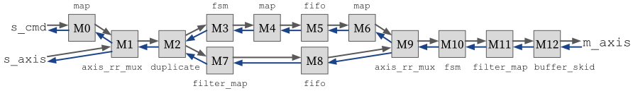

# ShakeFlow: Functional Hardware Description with Latency-Insensitive Interface Combinators

This repository contains the artifact for the following paper:

> ShakeFlow: Functional Hardware Description with Latency-Insensitive Interface Combinators.
> Sungsoo Han\*, Minseong Jang\*, and Jeehoon Kang (\*: co-first authors with equal contributions).
> ASPLOS 2023 (to appear, submission #43 of the Spring cycle).

The paper title has been changed from the following during the review:

> ShakeFlow: A Hardware Description Language Supporting Bidirectional Interface Combinators.


## Artifact Retrieval

- Option 1: from GitHub:

  ```
  $ git clone git@github.com:kaist-cp/shakeflow.git
  $ cd shakeflow
  ```

- Option 2: from Zenodo (a link will be provided to the reviewers).


## Artifact Contents

This artifact consists of the following directories:

- `./shakeflow-macro`: Rust macro for deriving `Signal` and `Interface` traits (Section 3)
- `./shakeflow`: the ShakeFlow compiler (Section 4)
- `./shakeflow-std`: the ShakeFlow standard library (Section 5)
- `./shakeflow-bsg`: our port of BaseJump STL to ShakeFlow (Section 5)
- `./shakeflow-corundum`: our port of Corundum 100Gbps NIC to ShakeFlow (Section 5)
- `./shakeflow-examples`: example ShakeFlow modules including FIR filter (Section 1, 2)
- `./scripts`: scripts to build the project, to perform evaluation, and to draw graphs (Section 6)

This artifact aims to achieve the following goals:
- G1: Locating ShakeFlow's core concepts (Section 3) in the development
- G2: Locating the submodules of Corundum's `tx_checksum` (Figure 9) in the development
- G3: Reproducing Table 1: SLOC of Corundum in Verilog and ShakeFlow
- G4: Reproducing Table 2: Resource Consumption of `C_Orig` and `C_SF`
- G5: Reproducing Figure 12: Throughput of NICs for TCP/IP Micro-benchmark (iperf)
- G6: Reproducing Figure 13: Throughput of NICs for Remote File Read Workload (fio)
- G7: Reproducing Figure 14: Throughput of NICs for Web Server and Client Workload
- G8: Reproducing Figure 15: Scalability of NICs for Web Server Workload


## G1: Locations of ShakeFlow's Core Concepts (Section 3)

| Paper Section | Concept | Location |
| --- | --- | --- |
| 3.1 Custom Interface Types | Custom Signal Types | `Signal` trait ([shakeflow/src/hir/signal.rs](shakeflow/src/hir/signal.rs))
| | Custom Channel Types | `Interface` trait, `channel!` macro ([shakeflow/src/hir/interface.rs](shakeflow/src/hir/interface.rs))
| | Composite Interface Types | `Interface` trait ([shakeflow/src/hir/interface.rs](shakeflow/src/hir/interface.rs))
| 3.3 Application-Specific Combinational Logics | Signal Expressions | `Expr` struct ([shakeflow/src/hir/expr.rs](shakeflow/src/hir/expr.rs))
| 3.4 Custom Interface Combinators | The Generic Combinator | `comb_inline` method ([shakeflow/src/hir/interface.rs](shakeflow/src/hir/interface.rs))
| | Custom Combinators | ShakeFlow's standard library ([shakeflow-std](shakeflow-std))
| 3.5 Module Combinators | Feedback Loops | `loop_feedback` method ([shakeflow/src/hir/module_composite.rs](shakeflow;e/src/hir/module_composite.rs))
| | Declarations | `module_inst` method ([shakeflow/src/hir/interface.rs](shakeflow/src/hir/interface.rs))

## G2: Locations of the Submodules of Corundum's `tx_checksum` (Figure 9)

An overview of the `tx_checksum` module is presented in the figure below.



For each submodule in the figure, corresponding lines in ShakeFlow are as follows.

No. | Submodule (Lines in [tx_checksum.rs](shakeflow-corundum/src/tx_checksum.rs)) | Description
--- | --- | ---
0 | map ([L110-113](shakeflow-corundum/src/tx_checksum.rs#L110-113)) | Adds always-asserted `tlast` wire to `s_axis_cmd` channel
1 | axis_rr_mux ([L116](shakeflow-corundum/src/tx_checksum.rs#L116)) | Muxes `s_axis` and `s_axis_cmd` in a round-robin manner
2 | duplicate ([L117](shakeflow-corundum/src/tx_checksum.rs#L117)) | Duplicates the channel into checksum pipeline (submodules 3-6) and the packet buffer (submodules 7-8)
3 | fsm ([L132-269](shakeflow-corundum/src/tx_checksum.rs#L132-269)) | Calculates a checksum from a command and a packet
4 | map ([L270-277](shakeflow-corundum/src/tx_checksum.rs#L270-277)) | Serializes checksum info
5 | FIFO ([L278](shakeflow-corundum/src/tx_checksum.rs#L278)) | Adds checksum info to FIFO queue
6 | map ([L279-283](shakeflow-corundum/src/tx_checksum.rs#L279-283)) | Deserializes checksum info
7 | filter_map ([L122-126](shakeflow-corundum/src/tx_checksum.rs#L122-126)) | Discards when the command (`s_axis_cmd`) come
8 | FIFO ([L128](shakeflow-corundum/src/tx_checksum.rs#L128)) | Adds data info to FIFO queue
9 | axis_rr_mux ([L287](shakeflow-corundum/src/tx_checksum.rs#L287)) | Selects one of csum and data from round-robin mux
10 | fsm ([L289-349](shakeflow-corundum/src/tx_checksum.rs#L289-349)) | Muxes two FIFO outputs in a round-robin manner
11 | filter_map ([L350-354](shakeflow-corundum/src/tx_checksum.rs#L350-354)) | Discards when the checksum value is not placed at the packet
12 | buffer_skid ([L355](shakeflow-corundum/src/tx_checksum.rs#L355)) | Adds a buffer

## G3: SLOC of Corundum in Verilog and ShakeFlow (Table 1)

We report the significant lines of code (SLOC, excluding comments empty lines) of the original and our ShakeFlow port of two IPs: the Corundum 100Gbps NIC and BaseJump STL's dataflow and network-on-chip modules. We use `cloc` to measure SLOC of each file.

The LOCs of our ShakeFlow ports reported here are lower than those reported in the accepted version of the paper, as we has further refactored the development since the re-submission.

### SLOC of Ported Corundum 100Gbps NIC modules

You can find the ported modules in [`shakeflow-corundum/src`](shakeflow-corundum/src).

No. | Module | LOC (Original) | LOC (ShakeFlow) | LOC (Generated Verilog)
--- | --- | --- | --- | ---
0 | (common types) ([ShakeFlow](shakeflow-corundum/src/types)) | | 384 |
1 | cmac_pad ([Original](https://github.com/corundum/corundum/blob/45b7e35/fpga/common/rtl/cmac_pad.v), [ShakeFlow](shakeflow-corundum/src/cmac_pad.rs)) | 54 | 20 | 59
2 | event_mux ([Original](https://github.com/corundum/corundum/blob/45b7e35/fpga/common/rtl/event_mux.v), [ShakeFlow](shakeflow-corundum/src/event_mux.rs)) | 128 | 17 | 203
3 | cpl_op_mux ([Original](https://github.com/corundum/corundum/blob/45b7e35/fpga/common/rtl/cpl_op_mux.v), [ShakeFlow](shakeflow-corundum/src/cpl_op_mux.rs)) | 179 | 57 | 277
4 | desc_op_mux ([Original](https://github.com/corundum/corundum/blob/45b7e35/fpga/common/rtl/desc_op_mux.v), [ShakeFlow](shakeflow-corundum/src/desc_op_mux.rs)) | 293 | 85 | 626
5 | rx_hash ([Original](https://github.com/corundum/corundum/blob/45b7e35/fpga/common/rtl/rx_hash.v), [ShakeFlow](shakeflow-corundum/src/rx_hash.rs)) | 202 | 183 | 2564
6 | rx_checksum ([Original](https://github.com/corundum/corundum/blob/45b7e35/fpga/common/rtl/rx_checksum.v), [ShakeFlow](shakeflow-corundum/src/rx_checksum.rs)) | 109 | 88 | 354
7 | tx_checksum ([Original](https://github.com/corundum/corundum/blob/45b7e35/fpga/common/rtl/tx_checksum.v), [ShakeFlow](shakeflow-corundum/src/tx_checksum.rs)) | 424 | 297 | 1466
8 | cpl_write ([Original](https://github.com/corundum/corundum/blob/45b7e35/fpga/common/rtl/cpl_write.v), [ShakeFlow](shakeflow-corundum/src/cpl_write.rs)) | 377 | 295 | 1090
9 | desc_fetch ([Original](https://github.com/corundum/corundum/blob/45b7e35/fpga/common/rtl/desc_fetch.v), [ShakeFlow](shakeflow-corundum/src/desc_fetch.rs)) | 438 | 321 | 1224
10 | rx_engine ([Original](https://github.com/corundum/corundum/blob/45b7e35/fpga/common/rtl/rx_engine.v), [ShakeFlow](shakeflow-corundum/src/rx_engine.rs)) | 639 | 464 | 1265
11 | tx_engine ([Original](https://github.com/corundum/corundum/blob/45b7e35/fpga/common/rtl/tx_engine.v), [ShakeFlow](shakeflow-corundum/src/tx_engine.rs)) | 641 | 498 | 1425
12 | queue_manager ([ShakeFlow](shakeflow-corundum/src/queue_manager.rs)) |  | 115 | 
13 | fetch_queue_manager ([Original](https://github.com/corundum/corundum/blob/45b7e35/fpga/common/rtl/queue_manager.v), [ShakeFlow](shakeflow-corundum/src/queue_manager.rs)) | 491 | 219 | 1862
14 | cpl_queue_manager ([Original](https://github.com/corundum/corundum/blob/45b7e35/fpga/common/rtl/cpl_queue_manager.v), [ShakeFlow](shakeflow-corundum/src/cpl_queue_manager.rs)) | 512 | 250 | 1984
15 | tx_scheduler_rr ([Original](https://github.com/corundum/corundum/blob/45b7e35/fpga/common/rtl/tx_scheduler_rr.v), [ShakeFlow](shakeflow-corundum/src/tx_scheduler_rr.rs)) | 630 | 498 | 2020
| | (total) | 5117 | 3791 | 16419 |

### SLOC of Ported BaseJump STL modules

You can find the ported modules in [`shakeflow-bsg/src`](shakeflow-bsg/src).

No. | Module | LOC (Original) | LOC (ShakeFlow) | LOC (Generated Verilog)
--- | --- | --- | --- | ---
0 | bsg_dataflow ([Original](https://github.com/bespoke-silicon-group/basejump_stl/tree/2c75c26996/bsg_dataflow), [ShakeFlow](shakeflow-bsg/src/bsg_dataflow)) | 3720 | 2004 | 19960
1 | bsg_noc ([Original](https://github.com/bespoke-silicon-group/basejump_stl/tree/2c75c26996/bsg_noc), [ShakeFlow](shakeflow-bsg/src/bsg_noc)) | 1703 | 1385 | 11463


## Compiling ShakeFlow Modules to Verilog

### Software Requirement

- Rust nightly-2022-09-27

### Script

To generate the Verilog code for the FIR filter (Section 2):

```
cargo run --bin shakeflow-examples
```

To generate the Verilog code for our ShakeFlow port of Corundum (Section 5):

```
cargo run --bin shakeflow-corundum
```

To generate the Verilog code for our ShakeFlow port of BaseJump STL's dataflow and network-on-chip modules (Section 5):

```
cargo run --bin shakeflow-bsg
```

The generated code is located in `build`.


## Building Corundum

We ported [Corundum](https://github.com/corundum/corundum)'s core packet processing functionalities, including descriptor and completion queue management, checksum validation and offloading, receive flow hashing, and receive-side scaling, from Verilog to ShakeFlow (Section 5, 6).

### Software Requirement

- Vivado 2021.1
- FPGA development and build environment for Corundum described in the [Corundum documentation](https://docs.corundum.io/en/latest/gettingstarted.html).

  + UltraScale Integrated 100G Ethernet Subsystem license is required. Instructions on how to obtain the license is specified in the Corundum documentation.


### Simulation Test

To run the entire testbench,

```
./scripts/corundum.py test_cocotb
```

To run a single test,

```
./scripts/corundum.py test_cocotb --tb <module_name>
```

Here, `<module_name>` can be one of the followings:

- for unit test: `cmac_pad`, `rx_checksum`, `rx_hash`, `tx_checksum`, `queue_manager`, `cpl_queue_manager`
- for integration test: `fpga_core`


### FPGA Bitstream Generation

- The Corundum documentation describes how to build the original Corundum (`C_orig` in Section 6).

- To build our ShakeFlow port of Corundum (`C_sf` in Section 6), run the command `./scripts/corundum.py program`:

  ```
  $ ./scripts/corundum.py program
      Finished dev [unoptimized + debuginfo] target(s) in 0.03s
       Running `target/debug/corundum`
  HEAD is now at b9323d16 Merge branch 'revert' into 'master'
  HEAD is now at b9323d16 Merge branch 'revert' into 'master'
  cd fpga && make
  rm -rf defines.v
  touch defines.v
  for x in ; do echo '`define' $x >> defines.v; done
  echo "create_project -force -part xcu200-fsgd2104-2-e fpga" > create_project.tcl
  echo "add_files -fileset sources_1 defines.v" >> create_project.tcl
  for x in  ../rtl/fpga.v  ../rtl/fpga_core.v  ../rtl/debounce_switch.v  ../rtl/sync_signal.v  ../rtl/common/mqnic_core_pcie_us.v  ../rtl/common/mqnic_core_pcie.v  ../rtl/common/mqnic_core.v  ../rtl/common/mqnic_interface.v  ../rtl/common/mqnic_port.v  ../rtl/common/mqnic_ptp.v  ../rtl/common/mqnic_ptp_clock.v  ../rtl/common/mqnic_ptp_perout.v  ../rtl/common/cpl_write.v  ../rtl/common/cpl_write_inner.v  ../rtl/common/cpl_op_mux_mqnic_port.v  ../rtl/common/cpl_op_mux_mqnic_port_inner.v  ../rtl/common/cpl_op_mux_mqnic_interface.v  ../rtl/common/cpl_op_mux_mqnic_interface_inner.v  ../rtl/common/desc_fetch.v  ../rtl/common/desc_fetch_inner.v  ../rtl/common/desc_op_mux.v  ../rtl/common/desc_op_mux_inner.v  ../rtl/common/event_mux.v  ../rtl/common/event_mux_inner.v  ../rtl/common/tx_queue_manager.v  ../rtl/common/tx_queue_manager_inner.v  ../rtl/common/rx_queue_manager.v  ../rtl/common/rx_queue_manager_inner.v  ../rtl/common/cpl_queue_manager.v  ../rtl/common/cpl_queue_manager_inner.v  ../rtl/common/event_cpl_queue_manager.v  ../rtl/common/event_cpl_queue_manager_inner.v  ../rtl/common/tx_cpl_queue_manager.v  ../rtl/common/tx_cpl_queue_manager_inner.v  ../rtl/common/rx_cpl_queue_manager.v  ../rtl/common/rx_cpl_queue_manager_inner.v  ../rtl/common/tx_engine.v  ../rtl/common/tx_engine_inner.v  ../rtl/common/rx_engine.v  ../rtl/common/rx_engine_inner.v  ../rtl/common/tx_checksum.v  ../rtl/common/tx_checksum_inner.v  ../rtl/common/rx_hash.v  ../rtl/common/rx_hash_inner.v  ../rtl/common/rx_checksum.v  ../rtl/common/rx_checksum_inner.v  ../rtl/common/stats_counter.v  ../rtl/common/stats_collect.v  ../rtl/common/stats_pcie_if.v  ../rtl/common/stats_pcie_tlp.v  ../rtl/common/stats_dma_if_pcie.v  ../rtl/common/stats_dma_latency.v  ../rtl/common/mqnic_tx_scheduler_block_rr.v  ../rtl/common/tx_scheduler_rr.v  ../rtl/common/tx_scheduler_rr_inner.v  ../rtl/common/cmac_pad.v  ../rtl/common/cmac_pad_inner.v  ../lib/eth/rtl/ptp_clock.v  ../lib/eth/rtl/ptp_clock_cdc.v  ../lib/eth/rtl/ptp_perout.v  ../lib/eth/rtl/ptp_ts_extract.v  ../lib/axi/rtl/axil_cdc.v  ../lib/axi/rtl/axil_cdc_rd.v  ../lib/axi/rtl/axil_cdc_wr.v  ../lib/axi/rtl/axil_interconnect.v  ../lib/axi/rtl/axil_crossbar.v  ../lib/axi/rtl/axil_crossbar_addr.v  ../lib/axi/rtl/axil_crossbar_rd.v  ../lib/axi/rtl/axil_crossbar_wr.v  ../lib/axi/rtl/axil_reg_if.v  ../lib/axi/rtl/axil_reg_if_rd.v  ../lib/axi/rtl/axil_reg_if_wr.v  ../lib/axi/rtl/axil_register_rd.v  ../lib/axi/rtl/axil_register_wr.v  ../lib/axi/rtl/arbiter.v  ../lib/axi/rtl/priority_encoder.v  ../lib/axis/rtl/axis_adapter.v  ../lib/axis/rtl/axis_arb_mux.v  ../lib/axis/rtl/axis_async_fifo.v  ../lib/axis/rtl/axis_async_fifo_adapter.v  ../lib/axis/rtl/axis_fifo.v  ../lib/axis/rtl/axis_pipeline_fifo.v  ../lib/axis/rtl/axis_register.v  ../lib/axis/rtl/sync_reset.v  ../lib/pcie/rtl/pcie_axil_master.v  ../lib/pcie/rtl/pcie_tlp_demux.v  ../lib/pcie/rtl/pcie_tlp_demux_bar.v  ../lib/pcie/rtl/pcie_tlp_mux.v  ../lib/pcie/rtl/dma_if_pcie.v  ../lib/pcie/rtl/dma_if_pcie_rd.v  ../lib/pcie/rtl/dma_if_pcie_wr.v  ../lib/pcie/rtl/dma_if_mux.v  ../lib/pcie/rtl/dma_if_mux_rd.v  ../lib/pcie/rtl/dma_if_mux_wr.v  ../lib/pcie/rtl/dma_if_desc_mux.v  ../lib/pcie/rtl/dma_ram_demux_rd.v  ../lib/pcie/rtl/dma_ram_demux_wr.v  ../lib/pcie/rtl/dma_psdpram.v  ../lib/pcie/rtl/dma_client_axis_sink.v  ../lib/pcie/rtl/dma_client_axis_source.v  ../lib/pcie/rtl/pcie_us_if.v  ../lib/pcie/rtl/pcie_us_if_rc.v  ../lib/pcie/rtl/pcie_us_if_rq.v  ../lib/pcie/rtl/pcie_us_if_cc.v  ../lib/pcie/rtl/pcie_us_if_cq.v  ../lib/pcie/rtl/pcie_us_cfg.v  ../lib/pcie/rtl/pcie_us_msi.v  ../lib/pcie/rtl/pulse_merge.v ; do echo "add_files -fileset sources_1 $x" >> create_project.tcl; done
  for x in  ../fpga.xdc  ../placement.xdc  ../cfgmclk.xdc  ../boot.xdc  ../lib/axi/syn/vivado/axil_cdc.tcl  ../lib/axis/syn/vivado/axis_async_fifo.tcl  ../lib/axis/syn/vivado/sync_reset.tcl  ../lib/eth/syn/vivado/ptp_clock_cdc.tcl ; do echo "add_files -fileset constrs_1 $x" >> create_project.tcl; done
  for x in  ; do echo "import_ip $x" >> create_project.tcl; done
  for x in  ../ip/pcie4_uscale_plus_0.tcl  ../ip/cmac_usplus_0.tcl  ../ip/cmac_usplus_1.tcl  ../ip/cms.tcl ; do echo "source $x" >> create_project.tcl; done
  for x in  ./config.tcl; do echo "source $x" >> create_project.tcl; done
  echo "exit" >> create_project.tcl
  vivado -nojournal -nolog -mode batch -source create_project.tcl

  ****** Vivado v2021.1 (64-bit)
    **** SW Build 3247384 on Thu Jun 10 19:36:07 MDT 2021
    **** IP Build 3246043 on Fri Jun 11 00:30:35 MDT 2021
      ** Copyright 1986-2021 Xilinx, Inc. All Rights Reserved.


  ################    skip a very large number of lines    ################


  Loading data files...
  Loading site data...
  Loading route data...
  Processing options...
  Creating bitmap...
  Creating bitstream...
  Bitstream compression saved 107757280 bits.
  Bitstream compression saved 162688128 bits.
  Bitstream compression saved 75638016 bits.
  Writing bitstream ./fpga.bit...
  INFO: [Vivado 12-1842] Bitgen Completed Successfully.
  INFO: [#UNDEF] WebTalk data collection is mandatory when using a WebPACK part without a full Vivado license. To see the specific WebTalk data collected for your design, open the usage_statistics_webtalk.html or usage_statistics_webtalk.xml file in the implementation directory.
  INFO: [Common 17-83] Releasing license: Implementation
  11 Infos, 27 Warnings, 1 Critical Warnings and 0 Errors encountered.
  write_bitstream completed successfully
  write_bitstream: Time (s): cpu = 00:05:03 ; elapsed = 00:03:45 . Memory (MB): peak = 6975.574 ; gain = 1178.840 ; free physical = 18610 ; free virtual = 171900
  # exit
  INFO: [Common 17-206] Exiting Vivado at Sat Nov 20 14:03:44 2021...
  mkdir -p rev
  EXT=bit; COUNT=100; \
  while [ -e rev/fpga_rev$COUNT.$EXT ]; \
  do COUNT=$((COUNT+1)); done; \
  cp fpga.bit rev/fpga_rev$COUNT.$EXT; \
  echo "Output: rev/fpga_rev$COUNT.$EXT";
  Output: rev/fpga_rev101.bit
  ```

  Usually, bitstream generation takes about 30-40 minutes. 

  The generated bitstream is located in `corundum/fpga/mqnic/AU200/fpga_100g/fpga/fpga.bit`.

- For test purposes, we build the original Corundum but with a single module being replaced with its ShakeFlow port, with the following command:

  ```
  $ ./scripts/corundum.py program_per_module --tb <module_name>
  ```

  Here, `<module_name>` can be a ported module listed in Table 1, e.g., `cmac_pad` and `event_mux`.


## Experimenting with Corundum

We explain how to generate the following figures (Section 6):

- Figure 12: Throughput of NICs for TCP/IP Micro-benchmark (`iperf`)
- Figure 13: Throughput of NICs for Remote File Read Workload (`fio`)
- Figure 14: Throughput of NICs for Web Server and Client Workload
- Figure 15: Scalability of NICs for Web Server Workload

### Software Requirement

- Vivado 2021.1
- FPGA development and build environment for Corundum described in the [Corundum documentation](https://docs.corundum.io/en/latest/gettingstarted.html).

  + UltraScale Integrated 100G Ethernet Subsystem license is required. Instructions on how to obtain the license is specified in the Corundum documentation.

### Hardware Requirement

For more details, refer to Section 6.

- Two machines with PCIe x16 slot running Linux.

  We use identical machines with the following configuration:
  + AMD Ryzen 5600X (3.7GHz, 6 cores, 12 threads) 
  + PCIe 4.0 interconnect
  + Ubuntu 20.04, Linux 5.11

- A commercial 100Gbps NIC installed on a machine.

  We use Mellanox MCX556A-EDAT (2-port 100Gbps NIC).

- Xilinx Alveo U200 installed on another machine.

- QSFP28 DAC cable to connect the NIC and U200 of the two machines.

- `fio` 3.16, `iperf` 2.0.13, `nginx` 1.18.0 on the machines for the evaluation workloads.

### Step 1: Preparation

The build and evaluation scripts must be run in a server that has SSH access to both machines. 
The SSH configuration must be set up so that both machines have their SSH alias set in the form of `f<NN>`, where `<NN>` stands for a two-digit number (e.g. `f01`).

### Step 2: Bitstream Programming on FPGA

Program the FPGA using the following script. 
Here, `$MACHINE` indicates the SSH alias of the machine that the U200 is installed. (e.g. `f01`)

```shell
./scripts/corundum.py program --machine $MACHINE --bit corundum/fpga/mqnic/AU200/fpga_100g/fpga/fpga.bit
```

### Step 3: Network Setup

The following script sets up the IP and MTU of the two machines.

```shell
# For evaluation on `C_orig` and `C_SF`:
./scripts/corundum.py setup --machine $MACHINE --server_machine $SERVER_MACHINE
# For evaluation on `M`:
./scripts/corundum.py setup_nic --machine $MACHINE --server_machine $SERVER_MACHINE
```

where `$MACHINE` and `$SERVER_MACHINE` indicates the SSH alias of the machine that the U200 and Mellanox NIC is installed, respectively.

In the case of `M`, since both machines have Mellanox NICs installed, `$MACHINE` and `$SERVER_MACHINE` can be chosen between the two machines arbitrarily.

The scripts used in the evaluation below also require `$MACHINE` and `$SERVER_MACHINE` variables in the same way.

Sample output:

```
$ ./scripts/corundum.py setup --machine f07 --server_machine f06
RTNETLINK answers: File exists
rmmod: ERROR: Module mqnic is not currently loaded
Cloning into 'corundum'...
HEAD is now at 45b7e356 Update readme
HEAD is now at 45b7e356 Update readme
make -C /lib/modules/5.4.0-128-generic/build M=/home/ubuntu/corundum/modules/mqnic modules
make[1]: Entering directory '/usr/src/linux-headers-5.4.0-128-generic'
  CC [M]  /home/ubuntu/corundum/modules/mqnic/mqnic_main.o
  CC [M]  /home/ubuntu/corundum/modules/mqnic/mqnic_dev.o
  CC [M]  /home/ubuntu/corundum/modules/mqnic/mqnic_netdev.o
  CC [M]  /home/ubuntu/corundum/modules/mqnic/mqnic_port.o
  CC [M]  /home/ubuntu/corundum/modules/mqnic/mqnic_ptp.o
  CC [M]  /home/ubuntu/corundum/modules/mqnic/mqnic_i2c.o
  CC [M]  /home/ubuntu/corundum/modules/mqnic/mqnic_board.o
  CC [M]  /home/ubuntu/corundum/modules/mqnic/mqnic_tx.o
  CC [M]  /home/ubuntu/corundum/modules/mqnic/mqnic_rx.o
  CC [M]  /home/ubuntu/corundum/modules/mqnic/mqnic_cq.o
  CC [M]  /home/ubuntu/corundum/modules/mqnic/mqnic_eq.o
  CC [M]  /home/ubuntu/corundum/modules/mqnic/mqnic_ethtool.o
  LD [M]  /home/ubuntu/corundum/modules/mqnic/mqnic.o
  Building modules, stage 2.
  MODPOST 1 modules
  CC [M]  /home/ubuntu/corundum/modules/mqnic/mqnic.mod.o
  LD [M]  /home/ubuntu/corundum/modules/mqnic/mqnic.ko
make[1]: Leaving directory '/usr/src/linux-headers-5.4.0-128-generic'
Cannot find device "eth0"
Cannot find device "eth0"
Cannot find device "eth0"
Setup complete!
```

Check that the environment is set up properly using the following script:

```shell
./scripts/corundum.py bench_one --machine $MACHINE --server_machine $SERVER_MACHINE
```

Expected output:

```
RTNETLINK answers: File exists
make -C /lib/modules/5.4.0-128-generic/build M={HOME path}/corundum/modules/mqnic modules
make[1]: Entering directory '/usr/src/linux-headers-5.4.0-128-generic'
  Building modules, stage 2.
  MODPOST 1 modules
make[1]: Leaving directory '/usr/src/linux-headers-5.4.0-128-generic'
Cannot find device "eth0"
Cannot find device "eth0"
Cannot find device "eth0"
Cannot find device "eth0"
2022-10-18 17:06:08.859266 Testing half-duplex mtu 9000 tx with iperf -P 5:
rcv: ['ssh', '-q', 'f06', 'iperf -s -P 5 -c 10.107.41.2']
snd: ['ssh', '-q', 'f07', 'iperf -c 10.107.41.1 -P 5  -t 10']
90.8 Gbps
2022-10-18 17:06:28.953719 Testing half-duplex mtu 9000 rx with iperf -P 5:
rcv: ['ssh', '-q', 'f07', 'iperf -s -P 5 -c 10.107.41.1']
snd: ['ssh', '-q', 'f06', 'iperf -c 10.107.41.2 -P 5  -t 10']
65.1 Gbps
```

### Step 4: Nginx Setup

In order to set up the environment for the nginx experiments used for Figure 14 and 15, use the following scripts.

```shell
./scripts/corundum.py setup_nginx --machine $MACHINE
./scripts/corundum.py setup_nginx --machine $SERVER_MACHINE
```

This script sets up the files that the nginx server will read and transmit to the client.
Each line takes about 4 hours to complete.

### Step 5: Execution

You can execute the following experiments with the `./scripts/corundum.py` script, which produces output as CSV files in `./scripts`.

You can pass additional variables to the build script to add additional identifiers in the output CSV filenames. 
Use the following script for more details.
```
./scripts/corundum.py -h
```


#### G4: Resource Consumption of `C_Orig` and `C_SF` (Table 2)

```
$ ./scripts/corundum.py util --corundum_path <corundum-path>
```

where the `<corundum-path>` is one of the followings:

- `./corundum` (if you generated bitstream by `program`)
- `./corundum-<module_name>` (if you generated bitstream by `program_per_module` with a specific `--tb <module_name>` argument)


#### G5: Throughput of NICs for TCP/IP Micro-benchmark (iperf, Figure 12)

For evaluation on `C_orig` and `C_SF`:

```shell
./scripts/corundum.py bench --machine $MACHINE --server_machine $SERVER_MACHINE # --name $NAME_THAT_WILL_BE_APPENDED
```

For evaluation on `M`:

```shell
./scripts/corundum.py bench_nic --machine $MACHINE --server_machine $SERVER_MACHINE # --name $NAME_THAT_WILL_BE_APPENDED
```

#### G6: Throughput of NICs for Remote File Read Workload (fio, Figure 13)

```shell
# For rx
./scripts/corundum.py fio --machine $MACHINE --server_machine $SERVER_MACHINE # --name $NAME_THAT_WILL_BE_APPENDED
# For tx
./scripts/corundum.py fio --machine $SERVER_MACHINE --server_machine $MACHINE --tx # --name $NAME_THAT_WILL_BE_APPENDED
```

#### G7: Throughput of NICs for Web Server and Client Workload (Figure 14)

```shell
# For rx
./scripts/corundum.py nginx_wrk --machine $MACHINE --server_machine $SERVER_MACHINE # --name $NAME_THAT_WILL_BE_APPENDED
# For tx
./scripts/corundum.py nginx_wrk --machine $SERVER_MACHINE --server_machine $MACHINE --tx # --name $NAME_THAT_WILL_BE_APPENDED
```

#### G8: Scalability of NICs for Web Server Workload (Figure 15)

```shell
# tx figure only, as server transfers files to the client.
./scripts/corundum.py nginx_scale --machine $SERVER_MACHINE --server_machine $MACHINE --tx # --name $NAME_THAT_WILL_BE_APPENDED
```

### Step 6: Figures

The scripts that plot the figures are located in `scripts/aggregate/$EXPERIMENT`, where `$EXPERIMENT` is one of `fio`, `iperf`, `nginx_wrk`, or `nginx_scale`.

To plot the figures, first place the result CSV files in 

```
scripts/csvs/$EXPERIMENT
``` 

if the experiment is `iperf` or `nginx_scale`, or

```
scripts/csvs/$EXPERIMENT/$DIRECTION
```

if the experiment is one of `fio` or `nginx_wrk`.
`$DIRECTION` should be either `rx` or `tx`. 
Data from the Mellanox experiments (i.e. **M**) should be placed in the `rx` directory.

CSV result files from **C_orig**, **C_SF**, **M** experiments should be named `corig*.csv`, `csf*.csv`, `m*.csv` respectively, e.g., `corig1.csv` ~ `corig10.csv`.

Then run

```
python3 scripts/aggregate/$EXPERIMENT/aggregate.py
python3 scripts/aggregate/$EXPERIMENT/plot.py
```

to get the figures. The resulting figures are saved in `scripts/aggregate/$EXPERIMENT`.


For convenience, `./evaluation` contains the raw results and graphs used in the paper.
